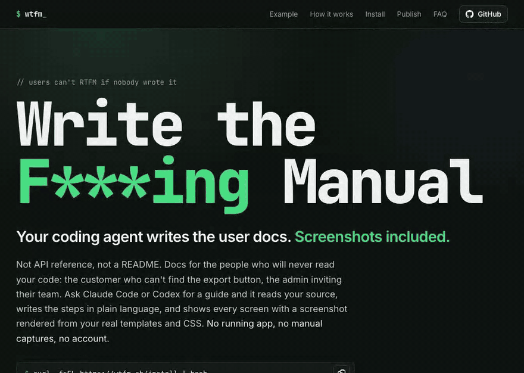
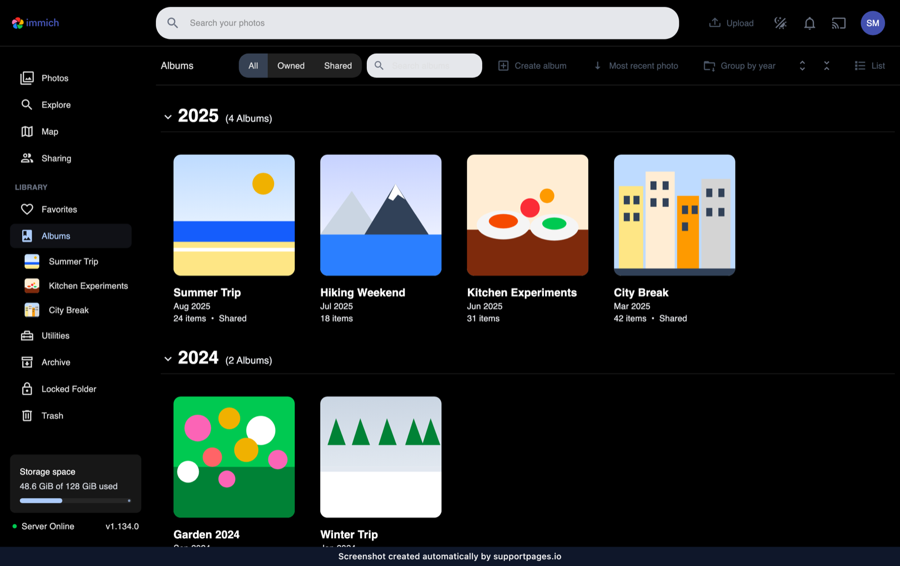
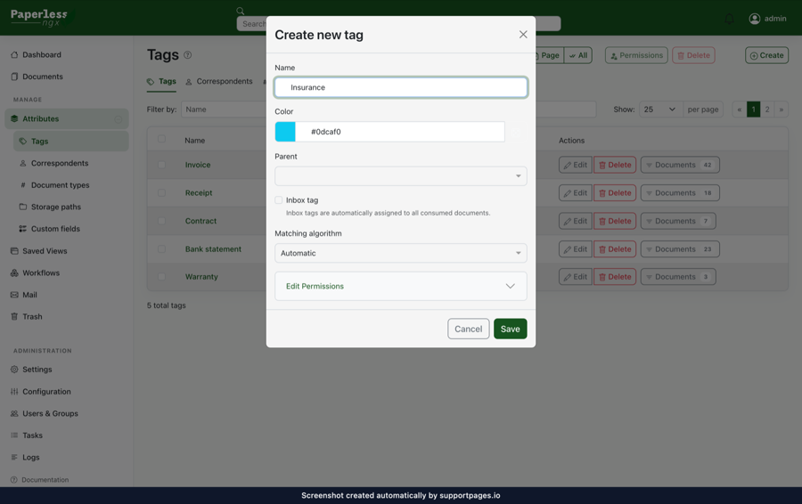
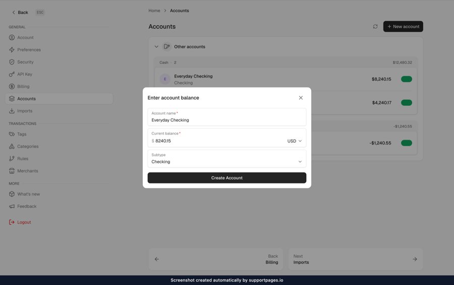

<h1 align="center">WTFM</h1>

<p align="center">
  <strong>Write the F***ing Manual.</strong><br>
  A plugin for your coding agent that writes the user docs. Screenshots included.
</p>

<p align="center">
  <a href="LICENSE"></a>
  
  
</p>

<p align="center">
  <a href="#install">Install</a> ·
  <a href="#quick-start">Quick start</a> ·
  <a href="#examples">Examples</a> ·
  <a href="#cli-commands">CLI</a> ·
  <a href="#publish">Publish</a> ·
  <a href="#faq">FAQ</a> ·
  <a href="https://help.wtfm.sh/">Docs</a> ·
  <a href="https://supportpages.io/wtfm">Website</a>
</p>

<p align="center">
  
  <br>
  <sub>Real output from <a href="https://github.com/plausible/analytics">plausible/analytics</a>, replayed fast. A real run takes a few minutes.</sub>
</p>

**WTFM is a plugin for your coding agent that writes your user docs.** Ask
[Claude Code](https://claude.com/claude-code) or [Codex](https://github.com/openai/codex)
for a guide and it reads your source, writes the steps in plain language, and shows every
screen with a screenshot rendered from your real templates and CSS. No running app, no
manual captures, no account.

Not API reference, not a README: docs for the people who will never read your code,
like the customer who can't find the export button, or the admin inviting their team.

> WTFM was formerly SupportPages Writer. The `supportpages` command still works as
> an alias for `wtfm`, and existing installations, settings and `SUPPORTPAGES_*`
> environment variables are unchanged.

Set it up once in your terminal, then just ask your agent:

```sh
curl -fsSL https://wtfm.sh/install | bash
```
```sh
wtfm setup          # once per computer
```
```sh
wtfm init           # once per project
```

> **You → Claude Code:** Write an illustrated guide to inviting a teammate.

## Features

- **Written from your source.** Routes, button labels and flows come from the code,
  not from a description you type, so the steps match what users actually see.
- **Screenshots without running the app.** Mockups are rebuilt from your own markup,
  styles and branding, then rendered to PNG in a local headless Chromium.
- **Plain Markdown output.** Each article is an `index.md` with its images beside it,
  ready to commit next to your code or drop into any docs site.
- **Checked before it's saved.** Every article passes structure, copy and screenshot
  checks first.
- **Uses the agent you already have.** Claude Code or Codex, with your own subscription
  and model settings.
- **Local-first.** Nothing is sent to SupportPages.io unless you choose to publish.

## Examples

The same loop on other open-source codebases. Each image is one screenshot from a
guide WTFM wrote from that repository's source; the apps were never run.

| [immich-app/immich](https://github.com/immich-app/immich) · SvelteKit | [paperless-ngx/paperless-ngx](https://github.com/paperless-ngx/paperless-ngx) · Angular | [maybe-finance/maybe](https://github.com/maybe-finance/maybe) · Rails |
| --- | --- | --- |
|  |  |  |
| How to create a new album | How to create a tag and apply it to a document | How to add a new account |

For a whole help centre, see [WTFM's own docs](https://help.wtfm.sh/): every
article and screenshot there was written by WTFM from this repository.

## Install

```sh
curl -fsSL https://wtfm.sh/install | bash
```

The installer downloads a checksum-verified release with its own Node.js, installs
the `wtfm` command into `~/.local/bin` (no `sudo`), and offers to add it to your
`PATH`. It also installs `supportpages` as an alias for `wtfm`.

**You'll need:**

- macOS or Linux, on ARM64 or x64 (on Windows, use WSL)
- [Claude Code](https://claude.com/claude-code) or [Codex](https://github.com/openai/codex),
  installed and signed in
- Git

Chromium for screenshots is downloaded the first time you run `wtfm setup`.

**Updating:** releases check for updates once a day and install them in the background.
Run `wtfm update` to update now, or set `SUPPORTPAGES_AUTO_UPDATE=0` to turn
automatic updates off.

### Build from source

You'll need Node.js 22.12 or later, npm and Git.

```sh
git clone https://github.com/SupportPages-io/wtfm.git
cd wtfm
./install-cli.sh
```

This builds your checkout and installs it as `wtfm` (with the `supportpages` alias).
Run `./install-cli.sh` again after pulling changes.

## Quick start

Configure once in the terminal, then do everything else in your coding agent.

### 1. Set up your computer

```sh
wtfm setup
```

This connects Claude Code and/or Codex, adds the SupportPages writer to them and
downloads the screenshot renderer. When it asks how you want to work, choose
**Save articles in my projects without an account**.

### 2. Set up your project

```sh
cd path/to/your-product
wtfm init
```

Pick where articles should be saved and which model to use. WTFM then
studies the project's structure, styles and branding once, so every article starts
from that analysis.

### 3. Ask your coding agent

Open Claude Code or Codex in your project (restart any session that was already open)
and ask for an article in plain words:

> Write an illustrated guide to inviting a teammate.

A few minutes later the article is in your project:

```text
output/articles/how-to-invite-a-teammate/
├── index.md
├── block_open-settings.png
├── block_invite-form.png
└── block_send-invite.png
```

That's the whole loop. Some other things to ask:

> What help articles do we have?

> Write a troubleshooting article for when a sign-in link has expired.

## CLI commands

You only need the terminal to set things up and keep them running. Writing happens in
your coding agent.

| Command | What it does |
| --- | --- |
| `wtfm setup` | Set up this computer: connect your coding agents and install the renderer |
| `wtfm init` | Set up this project: where articles go, which model, project analysis |
| `wtfm configure` | Change this project's agent, model, writing style or article folder |
| `wtfm analyse` | Re-run project analysis after big changes (`--refresh`) |
| `wtfm status` | Show this project's setup and article progress |
| `wtfm doctor` | Check that everything is installed and connected |
| `wtfm telemetry off` | Stop anonymous usage counts and crash reports (`on`, `status`) |
| `wtfm update` | Install the latest release |
| `wtfm uninit` | Forget this project's setup (keeps a recovery archive) |
| `wtfm remove` | Disconnect from your coding agents (keeps projects and articles) |
| `wtfm uninstall` | Remove WTFM from this computer; `--purge-config` also signs out and forgets project bindings |

Run `wtfm --help` for every option. `status` and `doctor` accept `--json`.

## Your articles

- **Where they go.** `output/articles/<slug>/` by default. To keep them in your repo,
  choose a folder like `docs/help` during `init` or with `wtfm configure`.
- **Writing style.** Pick from friendly, minimal, technical or formal with
  `wtfm configure`.
- **Screenshots.** Each article gets up to three. The main path gets them first;
  optional branches are described in text. Every screenshot carries a small
  "created automatically by supportpages.io" strip.

## How it works

1. `setup` connects a local [MCP](https://modelcontextprotocol.io) server and a
   writer agent to Claude Code or Codex.
2. `init` has your agent map the project once: framework, routes, layouts, CSS and
   branding.
3. When you ask for an article, the writer agent reads the relevant source, writes the
   steps, and builds each screenshot as an HTML mockup of your real UI.
4. The mockups are rendered to PNG with a local Chromium, checked against your source,
   and saved with the article.

## Publish

**Give your users somewhere to read it.** A Markdown folder in your repo helps nobody
who can't find it. [SupportPages.io](https://supportpages.io/?utm_source=wtfm&utm_medium=readme),
made by the same team, turns the guides WTFM writes into a help centre your users can
search and ask: on your own domain, in your branding, and kept current as the product
changes.

<p align="center">
  
</p>

- **Kept current on every merge.** When a pull request merges, SupportPages.io reads
  the diff and drafts the article updates for you to review.
- **Video walkthroughs.** Each guide can come with a narrated video that clicks through
  the same steps, with captions.
- **Answers, not just search.** Readers ask in their own words and get an answer drawn
  from your articles, with the sources linked.
- Your branding on your own domain, an editor to review drafts before anyone sees them,
  and publishing straight from your coding agent.

Everything above works without it, and a free account hosts up to 10 articles.

The same pattern applies: connect once in the terminal, then work in your agent.

**Connect a project:**

```sh
wtfm publish
```

You'll sign in or create an account in your browser and choose a help centre. Any
articles you've already saved upload as drafts. (Setting up a new project? Choose
**Publish them to a SupportPages.io help centre** during `wtfm init` instead.)

**Then keep asking your agent:**

> Write a guide to exporting a report.

New articles arrive in the help centre as drafts, with a link to review them in the
editor. Publishing is always a separate step: click **Publish** in the editor, or ask:

> Publish the guide to exporting a report.

| Command | What it does |
| --- | --- |
| `wtfm publish` | Sign in, pick a help centre and upload this project's saved articles |
| `wtfm yolo` | Write the whole manual on SupportPages.io (account required; drafts only) |
| `wtfm login` / `logout` | Sign this computer in or out |
| `wtfm sync` | Refresh help-centre settings and article history |

A help centre never needs access to your GitHub or Bitbucket. Only `wtfm yolo` does.

### `wtfm yolo`: write the whole manual

Starting from nothing? `wtfm yolo` plans every guide your product needs and
writes them all at once, on SupportPages.io's servers instead of your computer and your
coding agent's usage.

```sh
wtfm yolo
```

It walks you through whatever is missing: browser sign-in, choosing or creating a help
centre, and connecting your repository (SupportPages.io needs read access to write from
your code). It then shows your plan's article allowance and asks before starting
(`--yes` skips the question). The free plan covers your first 10 guides.

Progress shows live: sections, recommended articles, then drafts as they are written.
Everything lands as drafts; nothing goes live until you publish it in the editor, whose
link is printed at the end. Ctrl+C only stops watching: the run keeps going, and
`wtfm status` picks it up again. If a run fails, run `wtfm yolo` again to resume it
without losing the drafts already written.

## Privacy

- **Local projects send only anonymous usage counts and crash reports** to
  SupportPages.io (see below). Your coding agent and its model provider read your
  source, as they do for any other task.
- **Publishing uploads** the article, its images and a small provenance record.
  Your source code is never uploaded.
- **`wtfm yolo` writes on SupportPages.io** from the repository you connect there;
  it is the only command that gives SupportPages.io access to your code.
- **Credentials** are stored in private files under `~/.config/supportpages`, never in
  your repository.
- **Project analysis runs unattended.** `init` and `analyse` start your agent with its
  permission prompts off (`--dangerously-skip-permissions` for Claude Code,
  `--dangerously-bypass-approvals-and-sandbox` for Codex). Writing articles uses the
  agent's normal approval prompts.

### Anonymous usage counts and crash reports

WTFM tells us how many installs are in use and when something breaks, so we
can fix it. It says so the first time you set up a project, and it's easy to turn
off. It is sent to SupportPages.io without your sign-in and stays anonymous until
you sign in from this computer; after that, usage from this computer is linked to
your account. Turning it off stops both.

**What is sent**

- A random install ID created on this computer (not derived from it), the WTFM
  version, the coding client's name (e.g. `claude-code`), your OS, CPU architecture
  and Node.js major version.
- A count when WTFM is first used and when it is uninstalled (and whether its
  settings were kept), when a project is set up (local or hosted),
  and when an article or video walkthrough finishes: its outcome, where it went
  (local, uploaded or generated on SupportPages.io), an error code if it failed,
  and how many seconds it took; likewise when a `wtfm yolo` run starts and ends.
- For unexpected errors only: the error type and code, and stack frames with every
  path outside WTFM replaced by `<external>`. Messages from other code are
  never sent.

**What is never sent:** your code, file names or paths, article titles or content,
repository or project names, or credentials. Your IP address is not stored. The
install ID is also sent when you sign in from this computer, which is what links
later usage from it to your account.

**Turn it off** with any of these:

- ask your coding agent to turn off SupportPages telemetry;
- run `wtfm telemetry off`;
- set `SUPPORTPAGES_TELEMETRY=0` or `DO_NOT_TRACK=1`.

It is always off in CI. `wtfm doctor` shows whether it's on and why; set
`SUPPORTPAGES_TELEMETRY_DEBUG=1` to print each report to stderr as it is sent.

## FAQ

**Is this for API docs or READMEs?**
No. WTFM writes end-user documentation: how-to and troubleshooting guides for the
people who use your product, with screenshots. Your agent already handles developer
docs well.

**Why not just ask Claude Code to write the docs?**
It will write you decent steps. It won't show the screen, and it guesses at labels it
hasn't looked up. WTFM adds a project analysis, a renderer that builds screenshots from
your own UI code, and checks that run before anything is saved.

**What does it cost?**
WTFM is free and Apache 2.0. Articles run on your own Claude Code or Codex subscription.
`wtfm yolo` is the exception: it runs on SupportPages.io and needs an account; the free
plan covers 10 guides.

**`wtfm: command not found`**
Open a new terminal, or run the `PATH` command the installer printed.

**My agent can't see the SupportPages tools.**
Restart any Claude Code or Codex sessions that were open during `wtfm setup`.

**Setup won't finish.**
Run `wtfm doctor`, fix what it reports, then run `wtfm init` again.

**An article was interrupted halfway.**
Ask your agent to continue it, or run `wtfm status` to see where it stopped.

**Does it collect usage data?**
Only anonymous counts and crash reports, never your code or articles. See
[Anonymous usage counts and crash reports](#anonymous-usage-counts-and-crash-reports)
to see exactly what is sent or turn it off.

**Can I use it on Windows?**
Yes, inside WSL.

More on [supportpages.io/wtfm](https://supportpages.io/wtfm).

## Contributing

Bug reports and pull requests are welcome. When reporting a bug, include your OS,
`wtfm --version`, the command you ran and its output, with credentials and
private code removed. For larger changes, open an issue first so we can agree on the
approach.

To work on the code:

```sh
npm ci
npm test
node scripts/cli.mjs --help
```

The article engine in `engine/` is synced from upstream on each engine release, so
changes there are reviewed here and ported back by the maintainers.

## License

[Apache 2.0](LICENSE). The UI stylesheets bundled under `engine/` keep their own
licenses; see [NOTICE](NOTICE). The license doesn't cover the SupportPages name or logo.
